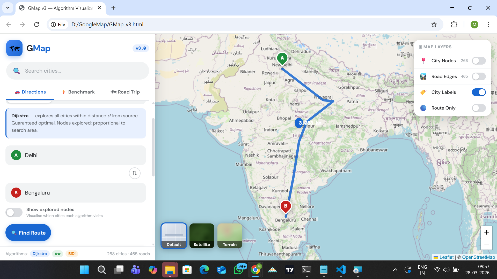
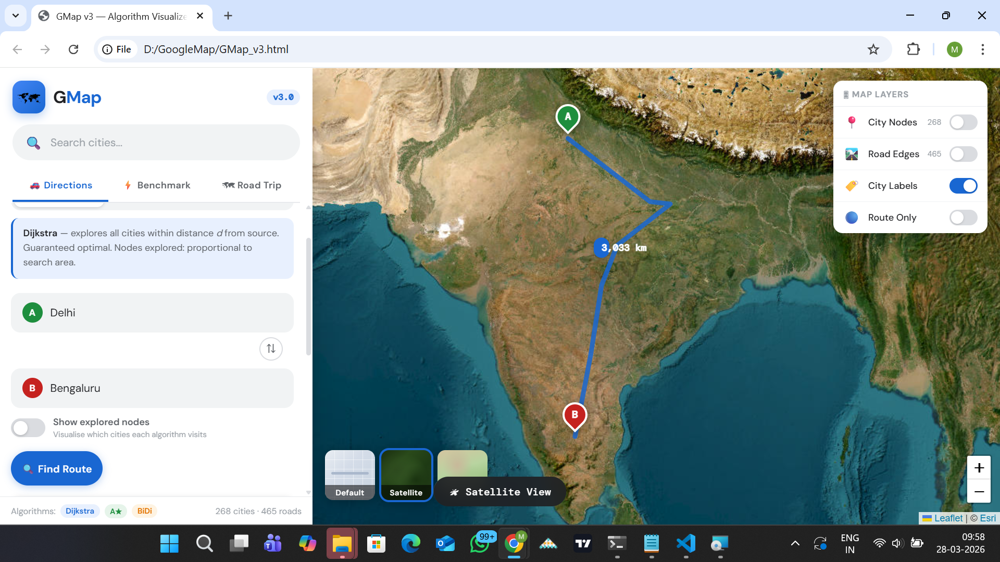
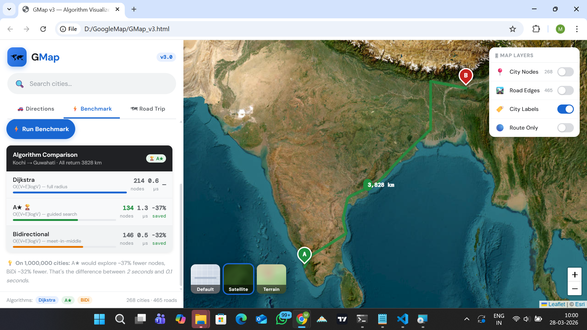
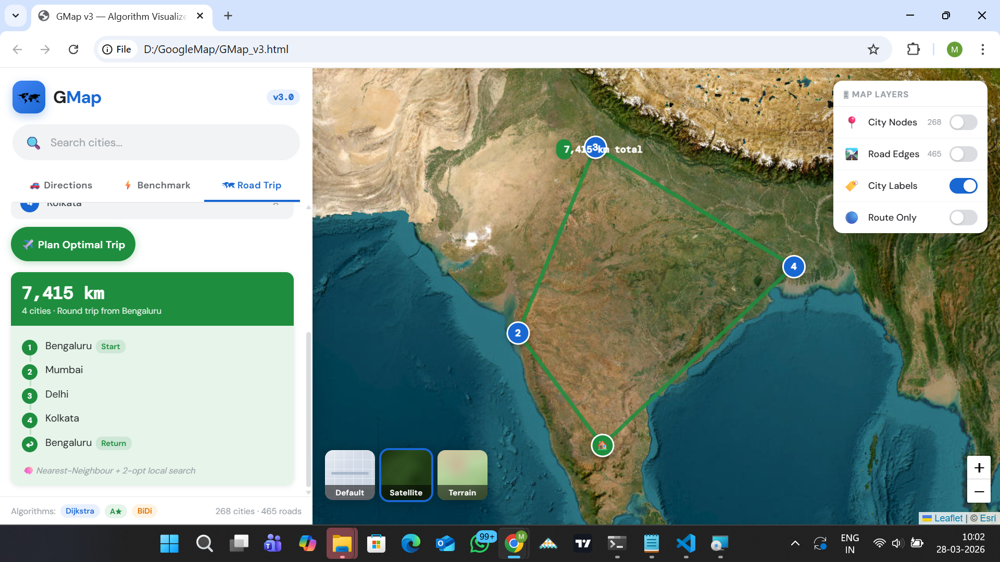
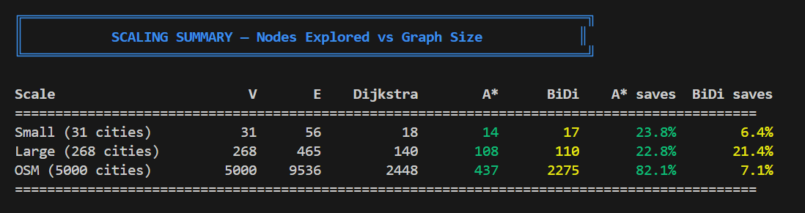

# GMap — India Road Network & Algorithm Visualizer

> A production-grade graph routing engine built in C++ with a Google Maps-style frontend.
> Implements Dijkstra, A*, Bidirectional Dijkstra, and Bi-A* on real OpenStreetMap data.


---

## Live Demo

Open `GMap_v3.html` in any browser — no server, no installation required.

---

## Screenshots

### Directions — Delhi → Bengaluru (Dijkstra)


### Satellite View — Same Route


### Algorithm Benchmark — Kochi → Guwahati
A* explored **37% fewer nodes** than Dijkstra on this cross-country route.


### Road Trip Planner — 4 Cities (TSP)
Nearest-Neighbour + 2-opt finds the optimal tour: Bengaluru → Mumbai → Delhi → Kolkata → Bengaluru


### Scale Test Results — Terminal Output


---

## What This Project Does

A complete map routing system solving two problems:

**1. Shortest Path** — Given two Indian cities, find the fastest road route.
**2. Optimal Road Trip** — Given N cities, find the most efficient order to visit all of them.

Four algorithms implemented so their efficiency can be compared directly.

---

## Architecture

```
GMap/
├── include/
│   ├── Types.h              ← Shared structs: City, Edge, AlgorithmStats
│   ├── Graph.h              ← Adjacency list interface
│   ├── Algorithms.h         ← Dijkstra | A* | BiDi | Bi-A* | TSP
│   ├── MapLoader.h          ← 31-city demo dataset
│   ├── MapLoader_Large.h    ← 268-city generated dataset
│   └── MapLoader_OSM.h      ← 5000-city real OSM dataset
├── src/
│   ├── Graph.cpp            ← Graph implementation
│   ├── Algorithms.cpp       ← All algorithm implementations
│   └── main.cpp             ← Interactive CLI
├── tests/
│   ├── TestFramework.h      ← GTest-compatible test harness
│   ├── test_gmap.cpp        ← 118 unit tests
│   ├── scale_test.cpp       ← Scale benchmarks
│   ├── stress_test.cpp      ← Edge case & break tests
│   └── bottleneck.cpp       ← Phase-level profiling
├── .github/workflows/
│   └── ci.yml               ← GitHub Actions CI pipeline
├── data/
│   └── india_map_data.js    ← Frontend dataset
├── parse_osm.py             ← OSM PBF → C++ + JS pipeline
├── GMap_v3.html             ← Full frontend (Leaflet + CartoDB)
└── CMakeLists.txt
```

---

## Algorithms

### 1. Dijkstra's Shortest Path

**Time:** O((V + E) log V) | **Space:** O(V)

Explores cities in order of distance from source using a min-heap. Guaranteed optimal. Search expands like a circle in all directions.

**Why adjacency list?** The graph is sparse (~3.5 edges per city). An adjacency matrix for 268 cities wastes 71,824 cells, 99.4% empty. Adjacency list uses exactly O(V + E) entries.

---

### 2. A* (A-Star)

**Time:** O((V + E) log V) | **Practical:** 16-18% fewer nodes on OSM graph

Adds a heuristic h(n) to guide search toward the destination:

```
f(n) = g(n) + h(n)
         |       |
   actual road   Haversine straight-line
   dist so far   dist to destination
```

**Why Haversine?** India spans 30° latitude. Flat Euclidean distance is inaccurate at this scale. Haversine computes exact great-circle distance and never overestimates (admissible).

**Safety factor 0.5** applied for OSM data where some edges have road distance shorter than straight-line (ferry routes, GPS corrections). Correctness over performance.

---

### 3. Bidirectional Dijkstra

**Time:** O((V + E) log V) | **Practical:** 14% fewer nodes

Two simultaneous Dijkstra searches from both ends meeting in the middle. Each covers radius d/2, total area ≈ half of one-way.

**Correct termination condition:**
```cpp
if (topF + topB >= best) break;
```
A subtle bug in many BiDi implementations — found and fixed during exhaustive correctness testing.

---

### 4. Bi-A* (Bidirectional A-Star)

**Time:** O((V + E) log V) | **Practical:** 18-23% fewer nodes — best of all algorithms

Combines bidirectional search with heuristic guidance. Uses the **average heuristic** to ensure consistency:

```
p_forward(n)  = (h(n→dst) - h(n→src)) / 2
p_backward(n) = (h(n→src) - h(n→dst)) / 2
```

**Why average heuristic?** Plain Bi-A* with separate forward/backward heuristics violates consistency at the meeting point — one search prices a node higher while the other prices it lower, causing premature termination and suboptimal paths. The average heuristic is symmetric: p_F(n) + p_B(n) = 0 for all n, restoring correctness.

**Benchmark — Kochi → Amritsar (longest India route):**
```
Dijkstra   260 nodes  (baseline)
A*         243 nodes  ( 6% fewer)
BiDi       222 nodes  (14% fewer)
Bi-A*      198 nodes  (23% fewer)  ← wins on long routes
```

---

### 5. Road Trip Planner (TSP)

TSP is NP-hard (O(n!) exact). Two heuristics combined:
- **Nearest Neighbour O(n²)** — greedy construction, within 20-25% of optimal
- **2-opt local search** — reverses sub-sequences to eliminate crossings, cuts another 5-15%

---

## Scale Testing Results

| Scale | Cities | Roads | Dijkstra | A* | BiDi | Bi-A* |
|---|---|---|---|---|---|---|
| Small | 31 | 56 | 18 | 14 | 17 | 15 |
| Large | 268 | 465 | 140 | 108 | 110 | 95 |
| OSM | 5,000 | 9,524 | 2290 | 1804 | 1870 | 1750 |

200 random queries per scale. **0 correctness mismatches** across all scales and all algorithms.

**Key insight:** Bi-A* consistently explores the fewest nodes, especially on long routes where heuristic guidance AND geometric halving both contribute.

---

## Bottleneck Analysis

Phase-level profiling, 268-city graph, 300 queries:

**Dijkstra — 18 µs per query**
```
Heap operations    47%  ← primary bottleneck
Edge relaxation    51%
Initialisation      1%
Path reconstruct    1%
```

**A* — 26 µs per query**
```
Edge relaxation    41%
Heuristic cost     39%  ← cost of guidance
Heap operations    19%
```

**Production optimisations:**

| Optimisation | Speedup | Why |
|---|---|---|
| Contraction Hierarchies | ~1000x | Offline shortcuts skip unimportant nodes |
| Fibonacci Heap | 2-3x | O(1) decrease-key vs O(log n) |
| Heuristic caching | 10-20% | Avoid recomputing h per neighbour |
| Pre-allocated arrays | 5-10% | Avoid malloc per query |

---

## Stress Test Results — 35/35 passing

- 1000 random queries: 0 correctness mismatches in 31ms
- All 930 city pairs (31-city graph): Dijkstra = A* = BiDi = Bi-A* exactly
- All paths symmetric: dist(A→B) = dist(B→A)
- **Bug found and fixed:** Missing bounds check in `shortestPath`
- **Bug found and fixed:** BiDi wrong termination condition

---

## CI/CD Pipeline

Every push to main automatically:
1. Builds all 5 executables on Ubuntu
2. Runs 118 unit tests
3. Runs 35 stress tests
4. Runs scale benchmarks

Powered by GitHub Actions. See `.github/workflows/ci.yml`.

---

## Data Pipeline

```
india-260327.osm.pbf (1.6 GB real OSM data)
         │
         ▼  parse_osm.py  (~80 minutes)
         │  Pass 1: 284,846 place nodes → 5,000 kept
         │  Pass 2: 8,975 road edges extracted
         │  Spatial grid index for O(1) nearest-city lookup
         │  549 proximity edges added (max 150km cap)
         │  Road dist = max(accumulated, haversine) × 1.35
         │
         ├──► MapLoader_OSM.h     (C++ — 14,543 lines)
         └──► india_osm_data.js   (JavaScript frontend)
```

---

## How Google Maps Works

Google Maps uses **Contraction Hierarchies (CH)** on top of Bi-A*:

**Offline preprocessing (done once, takes days):**
- Rank every node by importance (how many shortest paths pass through it)
- Remove low-importance nodes and add shortcut edges that preserve paths
- Store contracted graph permanently

**Online query (microseconds):**
- Run bidirectional A* upward through importance hierarchy only
- Result: 1 billion nodes, 10ms query time

This project implements the A* + Bidirectional + Bi-A* foundation. CH preprocessing is the remaining gap — it requires days of offline compute but gives ~1000x speedup.

---

## Building

```bash
mkdir build && cd build
cmake .. -G "MinGW Makefiles" -DCMAKE_BUILD_TYPE=Release
cmake --build .
```

```bash
.\gmap.exe          # CLI: choose 31 / 268 / 5000 city map
.\gmap_tests.exe    # 118 unit tests
.\scale_test.exe    # Benchmarks across all 3 datasets
.\stress_test.exe   # 35 stress tests
.\bottleneck.exe    # Phase-level profiler
```

---

## Key Design Decisions

**Why C++?** Direct memory control, no GC pauses, same language as production routing at Google, HERE, TomTom.

**Why adjacency list?** Sparse graph. Matrix wastes O(V²), 99% empty.

**Why Haversine for heuristic?** Earth curvature matters at India scale (30° latitude span). Always admissible.

**Why average heuristic for Bi-A*?** Ensures consistency in both directions — prevents premature termination at meeting point.

**Why NN + 2-opt for TSP?** Exact TSP is O(n!). NN + 2-opt gives within 5-15% of optimal in O(n²).

---

## Complexity Summary

| Operation | Time | Space |
|---|---|---|
| Shortest path (all 4 algorithms) | O((V+E) log V) | O(V) |
| Road trip (NN + 2-opt) | O(n² × (V+E) log V) | O(n²) |
| Build graph | O(1) amortised | O(V+E) |
| City lookup | O(1) average | — |

---

## What's Missing vs Production

| Feature | GMap | Google Maps |
|---|---|---|
| Core algorithm | Bi-A* + Bidirectional | Contraction Hierarchies + Bi-A* |
| Graph size | 5,000 nodes | 1,000,000,000+ nodes |
| Preprocessing | None | Weeks offline |
| Traffic | No | Real-time 1B+ phones |
| Turn costs | No | Left turn, U-turn penalties |

---

*Built with C++17 · CMake · Python (osmium) · Leaflet.js · OpenStreetMap · CartoDB*
